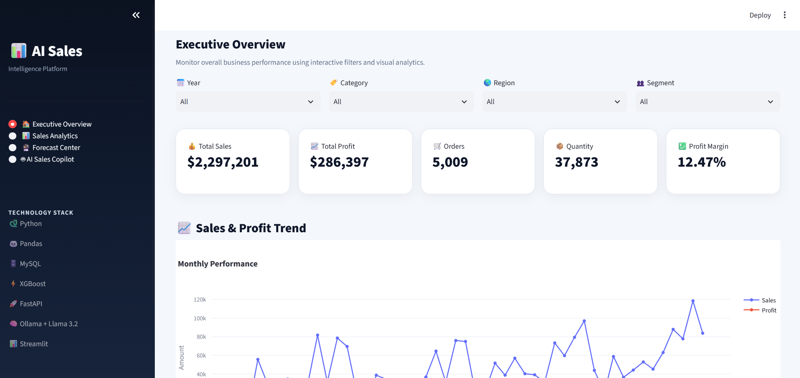
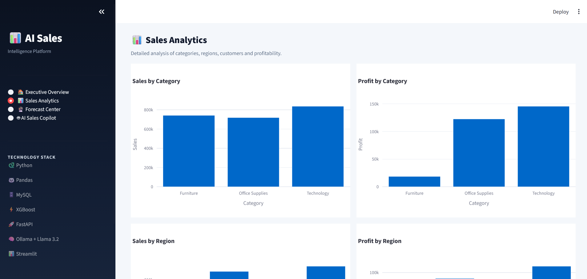
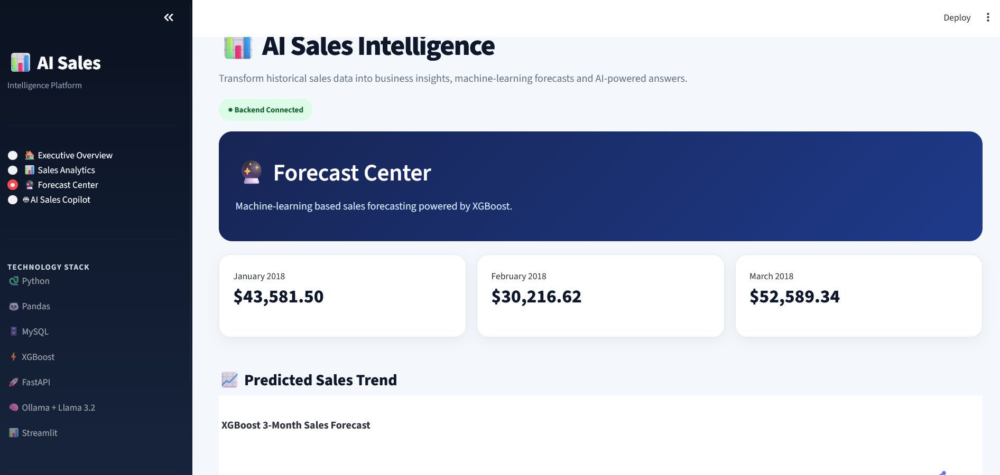
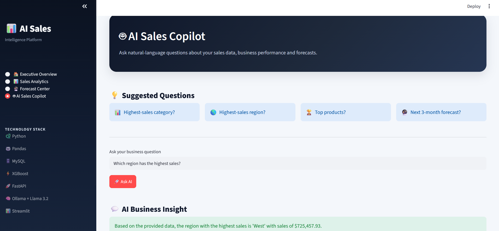
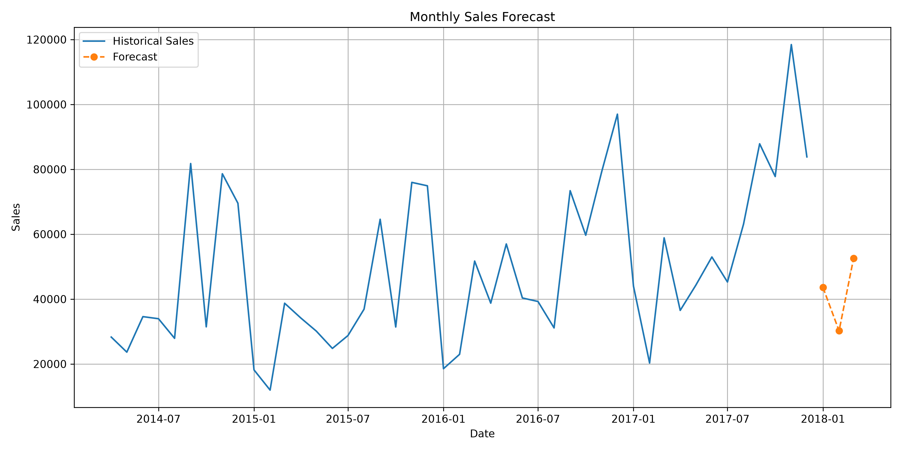

# 🤖 AI-Powered Sales Intelligence & Forecasting Assistant

An end-to-end **Sales Intelligence, Machine Learning, and Generative AI application** that transforms raw sales data into actionable business insights, sales forecasts, and natural-language answers.

The project combines **Python, SQL, MySQL, Machine Learning, XGBoost, FastAPI, Ollama, Llama 3.2, and Streamlit** into a complete analytics solution.

---

## 📌 Project Overview

Businesses generate large amounts of sales data, but extracting meaningful insights and predicting future performance can be challenging.

This project provides an interactive platform that allows users to:

- Analyze sales and profit performance
- Explore category, region, segment, and product-level insights
- Perform SQL-based business analysis
- Forecast future monthly sales using XGBoost
- Ask sales-related questions using natural language
- Receive AI-generated answers based on actual business data
- Explore all insights through an interactive Streamlit dashboard

---

## 🎯 Objectives

- Build an interactive sales analytics dashboard
- Store and analyze sales data using MySQL
- Perform SQL-based business intelligence analysis
- Develop a machine learning model for sales forecasting
- Integrate a local Large Language Model for natural-language business queries
- Build REST APIs using FastAPI
- Create a complete end-to-end analytics application

---

## 🏗️ System Architecture

```text
                Superstore Sales Dataset
                         │
                         ▼
                 Data Cleaning & EDA
                         │
                         ▼
                   MySQL Database
                         │
                         ▼
                  SQL Data Analysis
                         │
             ┌───────────┴───────────┐
             ▼                       ▼
      ML Forecasting            Business Insights
       XGBoost                        │
             │                        │
             └───────────┬────────────┘
                         ▼
                    FastAPI
                         │
                         ▼
              Ollama + Llama 3.2
                         │
                         ▼
                  Streamlit App
                         │
                         ▼
             AI Sales Intelligence

🛠️ Technology Stack
Programming Languages
Python
SQL
Data Analysis & Visualization
Pandas
NumPy
Matplotlib
Seaborn
Plotly
Machine Learning
Scikit-learn
XGBoost
Joblib
Database
MySQL
SQLAlchemy
PyMySQL
Backend
FastAPI
Uvicorn
Generative AI
Ollama
Llama 3.2 3B
Dashboard
Streamlit
Development Tools
VS Code
Git
GitHub

📊 Dataset

The project uses the Superstore Sales Dataset containing approximately 9,994 sales transactions.

Dataset Fields
Row ID
Order ID
Order Date
Ship Date
Ship Mode
Customer ID
Customer Name
Segment
Country
City
State
Postal Code
Region
Product ID
Category
Sub-Category
Product Name
Sales
Quantity
Discount
Profit


🧹 Data Cleaning & Preparation

The dataset was processed using Python and Pandas.

The preprocessing workflow includes:

Loading the raw dataset
Checking dataset dimensions
Identifying missing values
Checking duplicate records
Converting date columns to datetime format
Validating shipping dates
Creating a cleaned dataset
Saving the processed dataset for further analysis

The cleaned dataset is stored as:

data/processed/superstore_clean.csv

📈 Exploratory Data Analysis

The project performs detailed exploratory analysis including:

Descriptive statistics
Category analysis
Regional analysis
Customer segment analysis
Monthly sales analysis
Monthly profit analysis
Yearly performance analysis
Top product analysis
Sub-category analysis
State-level analysis
City-level analysis
Discount vs. profit analysis
Sales and profit correlation
Ship mode analysis
Customer sales analysis
Profit margin analysis
Loss-making product analysis
Monthly sales growth analysis


🗄️ MySQL Database

The cleaned sales dataset is stored in a MySQL database named:

sales_intelligence

The main table is:

sales

The database is used for SQL-based business analysis and provides the data layer for the FastAPI backend.

🔎 SQL Business Analysis

The project includes SQL analysis for:

Overall Performance
Total Sales
Total Profit
Total Quantity
Total Orders
Average Order Value
Product Analysis
Top products by sales
Top products by profit
Loss-making products
Sub-category performance
Customer Analysis
Top customers by sales
Customer segment performance
Geographic Analysis
Sales by region
Sales by state
Sales by city
Time-Based Analysis
Yearly sales
Yearly profit
Monthly sales
Monthly profit
Monthly sales growth
Business Analysis
Category performance
Profit margin
Discount vs. profit
Ship mode performance

🤖 Machine Learning — Sales Forecasting

The project uses XGBoost Regression to forecast monthly sales.

Forecasting Workflow
Transaction-Level Sales Data
            ↓
Monthly Sales Aggregation
            ↓
Feature Engineering
            ↓
Time-Based Train/Test Split
            ↓
XGBoost Regression
            ↓
Model Evaluation
            ↓
Future Sales Forecast
Features Used

The forecasting model uses:

Year
Month
Quarter
Lag 1
Lag 2
Lag 3
3-Month Rolling Average

A time-based train-test split is used so that future information is not used to train the model.

📊 Model Performance

The current XGBoost model produced the following evaluation results:

Metric	Value
MAE	14,321.73
RMSE	17,793.00
R²	0.4917

The trained model is saved as:

models/sales_forecasting_model.pkl
🔮 Sales Forecast

The current forecast generated by the model:

Forecast Month	Forecasted Sales
January 2018	$43,581.50
February 2018	$30,216.62
March 2018	$52,589.34

The forecast data is stored in:

data/processed/sales_forecast.csv

FastAPI Backend

FastAPI is used to provide REST API endpoints for the application.

Available Endpoints
Method	Endpoint	Description
GET	/	API information
GET	/sales-summary	Overall sales summary
GET	/top-products	Top products by sales
GET	/regional-analysis	Regional sales and profit
GET	/forecast	Sales forecast
POST	/ask-ai	AI-powered business assistant
📚 API Documentation

FastAPI automatically provides interactive Swagger documentation.

After starting the backend, open:

http://127.0.0.1:8000/docs
🧠 AI Sales Copilot

The project includes an AI-powered Sales Copilot using:

Ollama
    +
Llama 3.2 3B

The model runs locally, avoiding the need for a paid external LLM API.

The AI assistant receives relevant sales information from the MySQL database and forecasting results before generating an answer.

Example Questions
What are the total sales, total profit, and total orders?

Which category has the highest sales?

Which region has the highest sales?

What are the top 5 products by sales?

What is the average order value?

What are the forecasted sales for the next 3 months?

The application is designed to use the provided business data rather than inventing numerical results.

📊 Streamlit Dashboard

The Streamlit application provides an interactive business intelligence interface.

🏠 Executive Overview

The Executive Overview provides:

Year filter
Category filter
Region filter
Segment filter
Total Sales
Total Profit
Total Orders
Total Quantity
Profit Margin
Monthly Sales & Profit
Category Performance
Regional Performance
Customer Segment Analysis
Top 10 Products
Key Business Insights
📊 Sales Analytics

The Sales Analytics section provides detailed analysis of:

Category sales and profit
Regional sales and profit
Segment performance
Category profit margins
Business performance tables

🔮 Forecast Center

The Forecast Center provides:

Future sales forecast
Forecast visualization
Forecast table
MAE
RMSE
R²
Model information
🤖 AI Sales Copilot

The AI Sales Copilot allows users to ask questions about the sales data using natural language.

Users can select suggested questions or enter their own business question.

The response is generated using the local Llama 3.2 model through Ollama.

📁 Project Structure
AI-Sales-Intelligence/
│
├── api/
│   └── main.py
│
├── data/
│   ├── raw/
│   │   └── Superstore.csv
│   │
│   └── processed/
│       ├── superstore_clean.csv
│       └── sales_forecast.csv
│
├── database/
│
├── models/
│   └── sales_forecasting_model.pkl
│
├── notebooks/
│
├── screenshots/
│   └── sales_forecast.png
│
├── src/
│   ├── load_data.py
│   └── forecast_model.py
│
├── .env
├── .env.example
├── .gitignore
├── app.py
├── README.md
└── requirements.txt

⚙️ Installation & Setup
1. Clone the Repository
git clone <YOUR_GITHUB_REPOSITORY_URL>
cd AI-Sales-Intelligence
2. Create a Virtual Environment
python -m venv .venv
3. Activate the Virtual Environment
Windows
.venv\Scripts\activate
4. Install Dependencies
pip install -r requirements.txt
🔐 Environment Configuration

Create a .env file in the project root.

DB_HOST=localhost
DB_PORT=3306
DB_USER=root
DB_PASSWORD=your_mysql_password
DB_NAME=sales_intelligence
Important

Never upload your real .env file or database password to GitHub.

The repository contains:

.env.example

as a safe configuration template.

🗄️ Database Setup

Create the MySQL database:

CREATE DATABASE sales_intelligence;

Then configure the database credentials in .env.

Load the processed dataset into MySQL:

python src/load_data.py

The script loads the cleaned sales dataset into the sales table.

🤖 Ollama Setup

Install Ollama and download the local model:

ollama pull llama3.2:3b

Verify the model:

ollama list

You should see:

llama3.2:3b

The AI assistant uses this local model through the Python Ollama package.

▶️ Running the Application

The application requires two services:

FastAPI backend
Streamlit frontend
Start FastAPI

Open a terminal in the project root:

uvicorn api.main:app --reload

The API will run at:

http://127.0.0.1:8000
Start Streamlit

Open another terminal in the project root:

streamlit run app.py

The dashboard will run at:

http://localhost:8501
🔄 Application Workflow
User
 │
 ▼
Streamlit Dashboard
 │
 ├───────────────┐
 ▼               ▼
FastAPI       Dashboard
 │
 ├── MySQL
 │
 ├── XGBoost
 │
 └── Ollama
       │
       ▼
  Llama 3.2
       │
       ▼
AI Business Answer
🔒 Security

Sensitive configuration is stored in .env.

The following files and directories are excluded from Git:

.env
.venv/
__pycache__/
*.pkl

The project provides .env.example so that users can configure their own environment without exposing credentials.


# 📸 Dashboard Screenshots

## 🏠 Executive Overview

The Executive Overview provides a high-level view of sales performance, profitability, orders, quantity, and interactive business filters.



---

## 📊 Sales Analytics

The Sales Analytics section provides category, regional, and profitability analysis.



---

## 🔮 Forecast Center

The Forecast Center displays the XGBoost sales forecast, model performance metrics, and forecast results.



---

## 🤖 AI Sales Copilot

The AI Sales Copilot allows users to ask natural-language questions about sales performance and receive data-grounded answers.



---

## 📈 Sales Forecast

The project also includes the generated sales forecast visualization.



🚀 Future Enhancements

Potential future improvements include:

Advanced time-series forecasting
Automated anomaly detection
Product-level forecasting
Category-level forecasting
Automated data pipelines
Cloud deployment
Real-time database monitoring
Additional AI-powered business recommendations
Role-based dashboard access
More advanced GenAI analytics
Automated report generation
💡 Key Project Highlights

This project demonstrates an end-to-end implementation of:

Data Cleaning
      ↓
Exploratory Data Analysis
      ↓
SQL & MySQL
      ↓
Machine Learning
      ↓
XGBoost Forecasting
      ↓
FastAPI
      ↓
Generative AI
      ↓
Streamlit
      ↓
Business Intelligence

It combines Data Analytics + Machine Learning + Generative AI + Backend Development + Business Intelligence into a single portfolio project.

👩‍💻 Author
Panyala Rohini Reddy

B.Tech — Artificial Intelligence & Data Science

GitHub:

https://github.com/rohinireddy022-ai